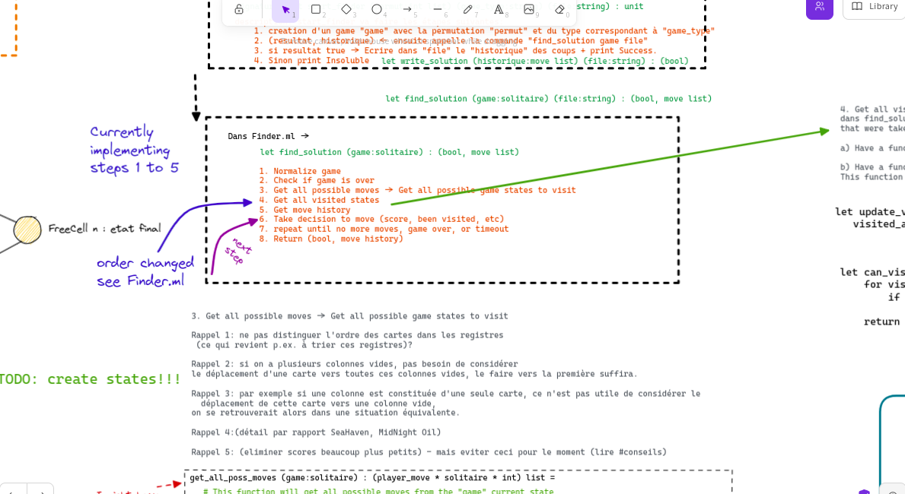

# Rapport PF5
- [Rapport PF5](#rapport-pf5)
  - [Identifiants](#identifiants)
  - [Fonctionnalités](#fonctionnalités)
    - [Création d'un jeu du type solitaire.](#création-dun-jeu-du-type-solitaire)
    - [Simulation d'une partie.](#simulation-dune-partie)
    - [Vérification d'un fichier solution.](#vérification-dun-fichier-solution)
    - [Recherche d'une solution pour un jeu solitaire.](#recherche-dune-solution-pour-un-jeu-solitaire)
  - [Compilation et exécution](#compilation-et-exécution)
  - [Découpage modulaire](#découpage-modulaire)
    - [TypeSol](#typesol)
    - [XpatRandom](#xpatrandom)
    - [Solver](#solver)
    - [Finder](#finder)
  - [Organisation du travail](#organisation-du-travail)
  - [Misc](#misc)
    - [Bugs et tests non passés](#bugs-et-tests-non-passés)
    - [Possibles modifications](#possibles-modifications)
    - [Remarques](#remarques)

## Identifiants

Voir [remarques](#remarques)

| Nom | Prénom | Identifiant | Numéro d'étudiant |
| ----------|---------|-------------|-------------------|
| Mollo Christondis | Felipe Paris | @mollochr | 22006343 |
| Cortial | Jade | @cortial | 22007013 |

---
## Fonctionnalités

### Création d'un jeu du type solitaire.
Dans ce projet, vous pourrez créer une variante (Freecell, Seahaven, Bakers, Midnight oil) de jeu solitaire en utilisant n'importe quelle graine de votre choix, les classes et les méthodes responsables pour cette fonctionnalité sont principalement définies sur `TypeSol.ml`, `Card.ml` et `XpatRandom.ml`.

### Simulation d'une partie.
Tous les mouvements, règles et fonctionnalités de jeu d'un jeu de solitaire sont également implémentés dans ce projet, vous pouvez tous les trouver dans le fichier `Solver.ml`.

### Vérification d'un fichier solution.
Une autre fonctionnalité implémentée dans ce projet consiste en une vérification de fichier qui consiste en un programme capable de recevoir un fichier en entrée et de vérifier si ce fichier contient une solution valide pour un jeu de Solitaire (`-check`). Ce fichier est censé être rempli de mouvements de jeu qui seront interprétés par le programme, après cela, le programme évaluera si l'ensemble des mouvements de jeu amène le jeu à une solution ou non. Les méthodes et les définitions de cette fonctionnalité sont également implémentées sur `Solver.ml`

### Recherche d'une solution pour un jeu solitaire.
Enfin, la dernière fonctionnalité implémentée et malheureusement pas complètement fonctionnelle mais très probablement à un bogue près d'être corrigée est la fonctionnalité `- search`. Cette fonctionnalité est capable de prendre un jeu de solitaire et sa graine, pour ensuite analyser si ce jeu a une solution possible. Si le jeu a une solution, le programme affichera l'ensemble des mouvements qui mèneront à un jeu réussi dans un fichier `out.sol`. Les méthodes et les définitions de cette fonctionnalité sont dans le fichier `Finder.ml`

---
## Compilation et exécution
Pour compiler le projet, vous pouvez executer la commande suivante:

```bash
dune build
```
Ensuite pour tester

```bash
dune test
```
On pourrait aussi tester un jeu et un type de graine spécifique, par example:

```bash
./run FreeCell.123 -check tests/I/fc123.sol
```
Cela va indiquer si le fichier `fc123.sol` est une solution ou pas pour le jeu `FreeCell`, initialisé avec la graine `123`.

---
## Découpage modulaire
En plus des fichiers existants dans le projet, tels que `Card.ml` et `XpatSolver.ml`, le projet est principalement défini par 4 modules.

Un module chargé par la définition et la création d'un jeu de solitaire `(TypeSol.ml)`. Après cela, afin de générer toute variation de solitaire, nous avons le module responsable par la génération de permurtations aléatoires (`XpatRandom.ml`). Une fois que nous avons les modules de création et de variation de jeux, nous avons le module responsable par les mécanismes et des règles du jeu (`Solver.ml`). En plus de cela, le module `Solver.ml` contient également les méthodes nécessaires pour vérifier une solution de fichier comme expliqué [ci-dessus](#vérification-dun-fichier-solution). Enfin, nous avons le module `Finder.ml` responsable par le processus de recherche de solutions pour un jeu.

Des modules tels que `TypeSol` et `XpatRandom` finissent par être des fondations / dépendances pour les autres modules de niveau supérieur. Voici une image montrant comment ils communiquent entre eux.

### TypeSol
Dans le fichier TypeSol, les définitions de ce qu'est une structure de jeu et de ce que représente un mouvement de jeu sont définies. En plus des définitions de structure de jeu, ce fichier se compose principalement de trois ensembles de fonctions.

```ocaml

type solitaire = {
  name : string;
  cols : card list Array.t;
  reg : card list Array.t;
  dep : int Array.t;
  hist : player_move list;
}

val prepare_game :
  string -> int list -> int -> int list -> int -> int -> solitaire = <fun>

val create_game : string -> int list -> solitaire = <fun>

val fill_game_attrib : solitaire -> int list -> int list -> solitaire = <fun>

```

Initialement la fonction `create_game()`, chargée de renvoyer un type de solitaire avec sa configuration et son jeu de cartes.

`prepare_game()` qui gère la configuration initiale d'un type solitaire et enfin les fonctions auxiliaires utilisées à `fill_game_attrib()` où toutes les structures de données sont remplies selon la règle du jeu et sa nature.

### XpatRandom
Le module `XpatRandom.ml` est chargé de renvoyer une permutation aléatoire basée sur une graine passée en paramètre. Ce module suit l'ordre indiqué dans le fichier. Voici un aperçu de la fonction principale de lecture aléatoire.

```ocaml
let shuffle n =
   let paires = create_paires n in
   let (f1_init, f2_init) = sort_and_fifo paires in
   let (res, new_f1, new_f2) = tirage_succ f1_init f2_init in
   let (result, _, _) = generate_52_tirages new_f1 new_f2 in
   let reduced_result = reduced_52 result in
   gen_perm reduced_result 
```
La fonction de lecture aléatoire comporte 6 étapes principales.
- `create_paires()` se charge d'appliquer l'algorithme défini au point (a), donc la création des 55 premiers tuples.
- `sort_and_fifo()` est responsable du point (b), triant et renvoyant deux structures de données fifos.
- `tirage_succ()` gère le processus de "shuffling" défini aux points (c) et (d).

Jusqu'à la dernière fonction `gen_perm()` qui appliquera tous les points ci-dessus et les autres non mentionnés ici afin de retourner une permutation aléatoire pour le jeu.

```ocaml
val gen_perm : int list -> int list = <fun>
val shuffle : int -> int list = <fun>
val tirage_succ : int list -> int list -> int list * int list * int list =
  <fun>
val sort_and_fifo : ('a * 'b) list -> 'b list * 'b list = <fun>
val create_paires : int -> (int * int) list = <fun>
val generate_52_tirages :
  int list -> int list -> int list * int list * int list = <fun>
val reduced_52 : int list -> int list = <fun>
```

### Solver
`Solver.ml` contient 4 fonctions principales, ces fonctions sont responsables de l'ouverture, de la lecture, de la validation et de l'exécution de chaque mouvement indiqué dans un fichier passé en paramètre.

```ocaml
val validate : player_move -> solitaire -> bool = <fun>
val execute_move : player_move -> solitaire -> bool = <fun>
val start_game : int list -> string -> string -> unit = <fun>
val solver_routine : solitaire -> string -> bool * int = <fun>
val read_and_execute : in_channel -> solitaire -> int -> bool * int = <fun>
```

- `start_game` lancera le jeu et la routine de résolution.
- `read_and_execute` bouclera chaque ligne du fichier et exécutera chaque mouvement.
- `execute_move` passera par les validations des règles et la structure du jeu, enfin il s'appliquera pour que le jeu s'envole après chaque coup.

### Finder
Le module de recherche, chargé de trouver une solution pour un jeu de solitaire, peut être défini principalement par trois parties.

La première étant la fonction `start_finder` responsable de la création du jeu, de l'appel de la routine `find_solution` et enfin de l'écriture de la solution dans un fichier (`write_solution`).

`find_solution` est la partie principale de ce module, l'algorithme implémenté suit les directives ci-dessus :

1. Normaliser le jeu
2. Vérifiez si le jeu est terminé
3. Obtenez tous les mouvements possibles à partir de cet état
4. Filtrez les mouvements non valides qui mèneront à un état déjà visité
5. Si la liste filtrée est vide, annulez le mouvement actuel/précédent.
6. S'il n'y a rien à annuler, alors retournez les résultats
7. Parmi les options filtrées, choisissez le score le plus élevé
8. Avancez avec le score le plus élevé.

Enfin la troisième section de ce fichier, se compose de toutes les fonctions auxiliaires utilisées à la fonction "find_solution" qui permettent à cela de fonctionner.
```ocaml
val write_solution : player_move list -> out_channel -> unit = <fun>
val start_finder : int list -> string -> string -> unit = <fun>
val find_solution :
  solitaire ->
  States.t -> solitaire list -> player_move list -> bool * player_move list =
  <fun>
val sort_by_score : ('a * 'b * 'c * 'd) list -> ('a * 'b * 'c * 'd) list =
  <fun>
val filter_next_steps :
  (bool * player_move * States.elt * int) list ->
  States.t -> (bool * player_move * solitaire * int) list = <fun>
```
---
## Organisation du travail
Les travaux ont débuté le 27 novembre et ont duré environ 6 semaines. Les tâches ont été séparées en fonction de la section projet. Au départ, les tâches concernaient la création et l'initialisation du type de jeu. Après cela, l'algorithme de permutation et pour conclure la première partie la mécanique du jeu et la vérification d'un fichier solution. Enfin, la dernière partie concernait l'algorithme de recherche de solution.

Pour le développement de chaque section et tâche, le processus de développement peut être résumé en 4 parties :
1. Lecture et compréhension de la tâche
2. Conception de solutions
3. Mise en œuvre
4. Test

Le développement et les tests ont été effectués simultanément, chaque fonction a été testée dans un environnement séparé avant d'être intégrée. Pour la conception de la solution, exalidraw diagrams a été utilisé.


---
## Misc

### Bugs et tests non passés
Malheureusement, en raison du contexte de développement du projet, un bug de la section `search` n'a pas pu être résolue entraînant un résultat de test pas parfait.

Le bug consiste probablement a une problème liée aux recherches de mouvement possibles où il semble que pas tous movement possible sont correctement trouvées lors de l'algorithme de `find_solution` de sorte que des jeux que devrait avoir des solutions finissent pour ne pas avoir.

### Possibles modifications
Une modification majeur mais que dû le temps et le context du projet n'as pas pu être realisé c'est le changement du type des variables `visited_seq` de la fonction `find_solution()`. Utilisés aussi lors de la fonction `sort_by_score()` et `filter_next_steps()`.

La variable est actuellement du type `solitaire list` mais cela n'est pas optimale, donc un changement vers un type `States` est beacoup plus pertinent. 

### Remarques

Il est important de souligner que ce projet devrait initialement se faire en équipe de deux. Cependant, il me semble que Jade cortial (@cortial) a eu un problème de santé pendant le processus et le projet a été presque entièrement réalisé par un seul membre, Felipe Paris Mollo Christondis(@mollochr). Cela a fini par affecter le projet de plusieurs manières, l'une étant la charge de travail élevée qui a fait que tous les tests n'ont pas réussi avant la date d'échéance.

---
